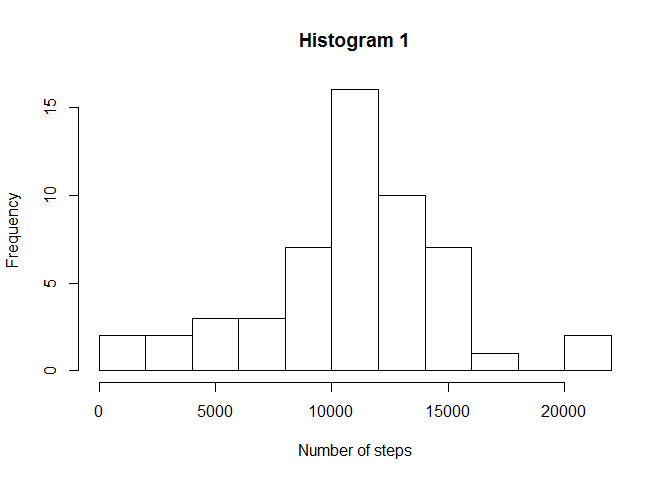
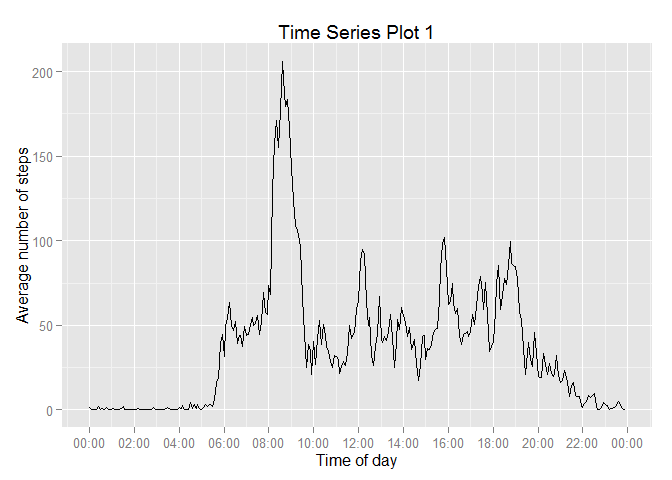
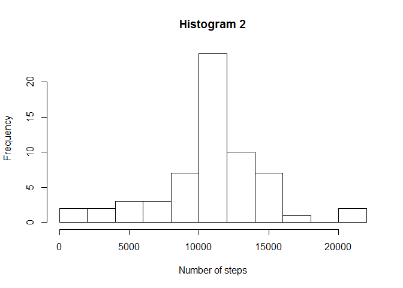
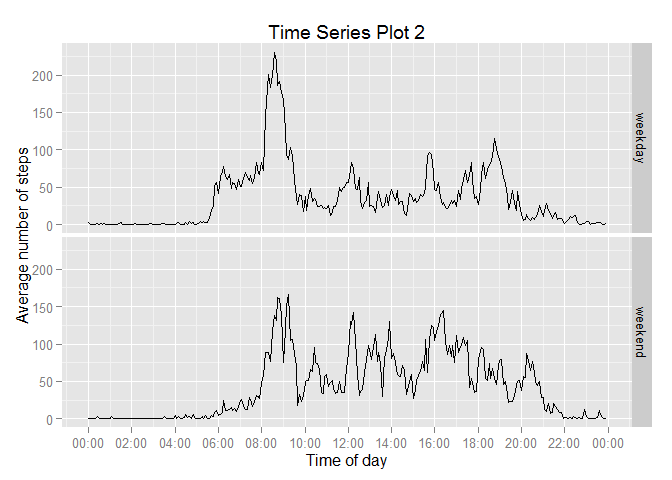

# Reproducible Research: Peer Assessment 1
## Introduction
This assignment consists of multiple parts that answers questions related to data from a personal activity monitoring device that collects data at 5 minute intervals throughout the day. The data consists of two months of data from an anonymous individual collected during the months of October and November, 2012 and includes the number of steps taken in 5 minute intervals each day.

The raw data consists of three variables - steps (which is the number of steps taken in the specific 5-minute interval), date, and interval)

## Part 1: Loading and preprocessing the data

### Loading


```r
rawdata <- read.csv("activity.csv")
```

### Preprocessing

Step 1: Created a copy of the raw data. 


```r
data1 <- rawdata
```

Step 2: Converted the date variable from factor to date class. 


```r
data1$date <- as.Date(as.character(data1$date))
```

Step 3: Created a new column "time" by converting the interval variable from integer to a datetime format. This has been done in two steps. The first code chunk converts the interval variable from integer to character string in the form of HH:MM. The function f1 is used to prefix the interval variable with zeroes in order to create a length of 4 for the time string. Since we are only interested in the time part, the next code chunk converts the character to POSIXlt using the strptime function and in doing so, appends the current date to the time part. Finally the time column is converted to POSIXct class that ggplot can handle. The class conversion happens as follows: integer ---> character ---> POSIXlt ---> POSIXct. 


```r
data1$time <- as.character(data1$interval)
f1 <- function(a) {
        paste0 <- ""
        if (nchar(a) == 1) {
                paste0 <- "000"
        } else if (nchar(a) == 2) {
                paste0 <- "00"
        } else if (nchar(a) == 3) {
                paste0 <- "0"
        }
        a <- paste(paste0,a,sep="")
        a <- paste(substr(a,1,2), ":", substr(a,3,4), sep="")
}
data1$time <- lapply(data1$time, f1)
```


```r
data1$time <- strptime(data1$time, "%H:%M")
data1$time <- as.POSIXct(data1$time)
```

## Part 2: What is mean total number of steps taken per day?

### Histogram of total number of steps taken each day (ignoring NAs)

To plot the histogram of the total number of steps, first calculated the total number of steps each day and then plotted the histogram. 


```r
totalsteps <- aggregate(steps ~ date, data = data1, sum)
```

Histogram 1.


```r
hist(totalsteps$steps, breaks=10, xlab="Number of steps", main="Histogram 1")
```

 

### Mean and median number of steps each day. 


```r
totalmean <- format(mean(totalsteps$steps), scientific=FALSE, digits=0)
totalmedian <- median(totalsteps$steps)
```

The **mean** number of steps taken per day is **10766** steps.

The **median** number of steps taken per day is **10765** steps.

## Part 3: What is the average daily activity pattern?

### Time-series plot of average number of steps taken

To make a time-series plot of the 5-minute interval and the average number of steps taken, first calculated the average number of steps across all the days for each time interval. 


```r
avgsteps <- aggregate(steps ~ time, data = data1, mean)
```

Loaded the required libraries to build the time series plot.


```r
library(ggplot2)
library(scales)
```

Time-series plot 1. 

*Note: Had to include the timezone while formatting since the default was UTC and the graph showed times from 7 am to 7 am next day since the data stored in the time column was my current date in the PDT timezone appended to the time interval.*


```r
ggplot(data=avgsteps, aes(x=time, y=steps)) + 
        geom_line() + 
        scale_x_datetime(
                breaks = date_breaks("2 hour"),
                labels = date_format("%H:%M", tz="America/Los_Angeles")) +
        labs(x = "Time of day", y = "Average number of steps") + 
        ggtitle("Time Series Plot 1")
```

 

### Maximum number of steps  


```r
avgmax <- format(avgsteps[which(avgsteps$steps == max(avgsteps$steps)),1], "%H:%M")
```

The 5-minute interval during which **maximum** number of steps have been taken on average is **08:35.**

## Part 4: Imputing missing values

### Missing values in the raw data 

The raw data contains a number of NAs, indicating that the number of steps during that day/time interval is unavailable. 


```r
missing <- sum(is.na(rawdata$steps))
```

The **total number of missing values** in the raw data is **2304.**

### Strategy to fill missing values 

The missing values for any time interval in the raw data can be replaced by the corresponding average number of steps calculated in the previous part. This strategy assumes that the walking pattern changes depending on the time of the day.  

### New dataset with missing values filled 


```r
library(plyr)
```

Used the "join" function from plyr to merge the preprocessed rawdata contained in data1 and the avgsteps dataframe by the common column "time". Changed the column name of "steps" in avgsteps dataframe to "avgsteps" before the join. After merging, replaced the NA values in "steps" column with the values in the corresponding "avgstep" column. The dataframe "filledrawdata" contains the data with the missing values filled with average values.


```r
colnames(avgsteps)[2] <- "avgsteps"
data2 <- join(data1, avgsteps, by="time", type="left")
data2$steps[is.na(data2$steps)] <- data2[which(is.na(data2$steps)),5]
filledrawdata <- data2[,1:3]
```

First 10 rows of rawdata.


```r
head(rawdata, 10)
```

```
##    steps       date interval
## 1     NA 2012-10-01        0
## 2     NA 2012-10-01        5
## 3     NA 2012-10-01       10
## 4     NA 2012-10-01       15
## 5     NA 2012-10-01       20
## 6     NA 2012-10-01       25
## 7     NA 2012-10-01       30
## 8     NA 2012-10-01       35
## 9     NA 2012-10-01       40
## 10    NA 2012-10-01       45
```

First 10 rows of filledrawdata.


```r
head(filledrawdata, 10)
```

```
##        steps       date interval
## 1  1.7169811 2012-10-01        0
## 2  0.3396226 2012-10-01        5
## 3  0.1320755 2012-10-01       10
## 4  0.1509434 2012-10-01       15
## 5  0.0754717 2012-10-01       20
## 6  2.0943396 2012-10-01       25
## 7  0.5283019 2012-10-01       30
## 8  0.8679245 2012-10-01       35
## 9  0.0000000 2012-10-01       40
## 10 1.4716981 2012-10-01       45
```

### Histogram, mean and median of total steps using filled dataset 


```r
totalstepsfilled <- aggregate(steps ~ date, data = data2, sum)
```

Histogram 2.


```r
hist(totalstepsfilled$steps, breaks=10, xlab="Number of steps", main="Histogram 2")
```

 

Mean and median number of steps each day. 


```r
totalmeanfilled <- format(mean(totalstepsfilled$steps), scientific=FALSE, digits=0)
totalmedianfilled <- format(median(totalstepsfilled$steps), scientific=FALSE, digits=0)
```

The **mean** number of steps taken per day with missing values filled is **10766** steps.

The **median** number of steps taken per day with missing values filled is **10766** steps.

The mean and median of the total steps with the filled dataset do not differ considerably from the estimates calculated in the Part 2 of the assignment. The histogram shows an increase in the frequency (number of days) where the total steps falls in the 10000 to 12000 bin, which is to be expected since the mean and median too fall in that range.

## Part 5: Are there differences in activity patterns between weekdays and weekends?

### Weekday & weekend indicator


```r
data3 <- data2[,1:4]
data3$day <- as.factor(ifelse 
                       (weekdays(data3$date, abbreviate=TRUE) %in% c("Sat", "Sun"),
                        "weekend", 
                        "weekday")
                       )
```

### Panel plot showing weekday & weekend activity separately

First calculated the average number of steps on weekends and weekdays for each time interval. 


```r
avgstepsbytype <- aggregate(steps ~ day+time, data = data3, mean)
```

Time-series plot 2.


```r
ggplot(data=avgstepsbytype, aes(x=time, y=steps)) + 
        geom_line() + 
        facet_grid(day ~ .) + 
        scale_x_datetime(
                breaks = date_breaks("2 hour"),
                labels = date_format("%H:%M", tz="America/Los_Angeles")) + 
        labs(x = "Time of day", y = "Average number of steps") + 
        ggtitle("Time Series Plot 2")
```

 

## End of Document
